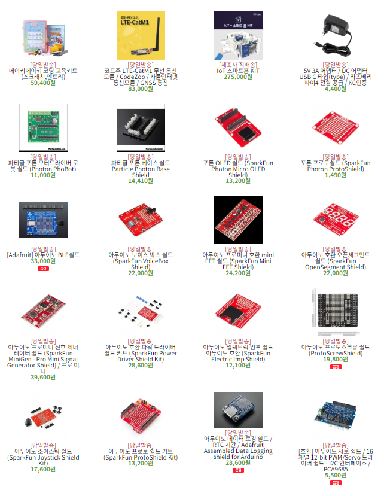
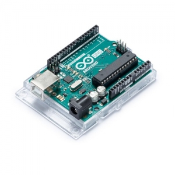
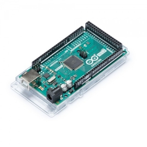
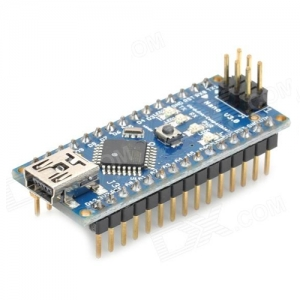
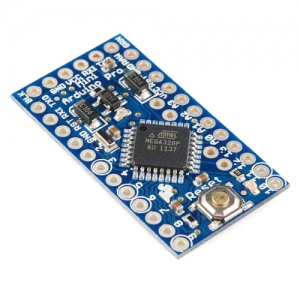
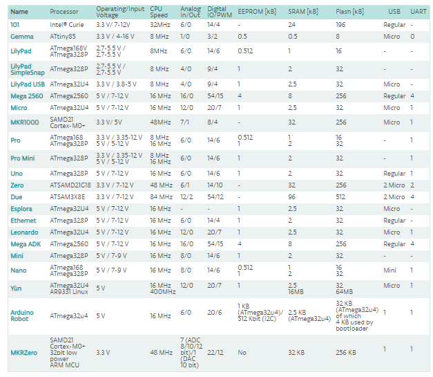

# Arduino_기초 교육
## 목차
1. Arduino란?
2. Arduino 종류 
3. Arduino 각각의 요놈의 성능  
4. Arduino Uno 핀
5. Arduino 동작시키키 위한 과정
6. 마지막으로..
* * *
### 1. Arduino란?   

   아두이노(Arduino)는 오픈소스를 기반으로 한 단일 보드 마이크로컨트롤러이다. 아트멜AVR을  
기반으로 한 보드로 이루어져 있고 최근에는 Cortex-M3를 이용한 제품(Arduino Due)도 있다.   
소프트웨어 개발을 위한 통합 환경(IDE)이 있다. 아두이노는 다수의 스위치나 센서로부터 값을 받아들여, LED나 모터와   
같은 외부 전자 장치들을 통제함으로써 환경과 상호작용이 가능한 물건을 만들어 낼 수 있다.   
       
   
   
  ### _어려운 설명말고 다시 쉽게!!!_   
   아두이노는 자신이 원하는 프로젝트를 만들기 위한 작은 컴퓨터이다! Game을 python으로 만들려면 pygame을 다운   
해야하고 data 분석을 위해서는 anaconda가 필수이다. 그렇다면 여러분이 만들고 싶은 프로젝트를 만들기 위해서는   
이것도 필요하고 저것도 필요하고 프로젝트는 프로젝트대로 머리만 지끈 지끈아픈디....   
   
      
         
.   

.   
.      
.
      
    
    
 ### _아두이노는 이런 여러분을 구제 하여 줄 것입니다._
 ***
 ### 2. Arduino 종류
 프로젝트를 진행하기 위해 Arduino를 살려고하는데 holy sh...!   
      
  　   
  
 뭐가 이리 많어.....   
 
  ### ***스피드 웨건*** : 사야 될 꺼 딱정해 드립니다.      
   　
    
 
_아두이노 UNO 보드_ : 아두이노의 표준 보드로 온라인 상에 있는 대부분의 예제와 강좌, 소스 라이브러리가 UNO보드에 맞춰져 
있기 때문에 초보자라면 당연히 UNO 보드를 선택하시면 됩니다. 현재 R3 번전까지 나와있습니다.   
##### => 가장 기본적이 아두이노로 밑에 꺼 안쓸거고 아몰랑 하시면 일단 이거 사시면 됩니당
   

_아두이노 Mega 보드_ : 아두이노 UNO보드의 약 2배 크기에 제어할 수 있는 핀도 훨씬 많고, 더 빠르고, 저장용량도  
더 많이 가진 보드입니다. 아두이노 UNO보드에서 처리하기 힘든 멀티미디어 관련 작업이나 복잡한 제어가 필요한  
작업에 알맞는 보드 입니다. RX TX 즉 수신단 송신단 두개가 필요한 센서들인 블루투스, 적외선 등등을 여러개  
 사용할 때 여러 개 사용하 실 때 Mega를 사용 하시면 됩니다. 하지만 Mega의 오픈 소스는 훨씬 작으므로 조심  
 원래 잘 작동하던 센서들도 안 되는 경우가 많습니다. 이렇게 되면 끝없는 혼돈의 소용돌이에 빠지게 되니  
 arduino를 좀 잘 다룰줄 안다! 이러시는 분들에게 추천 드립니다. 빠르긴 정말 빠릅니다.  
 ##### => 가장 빠르고!! 가장 저장 공간 많고!! 가장 성능 좋고!! 센서도 많고!! 겁나 어렵고!!(?)  
    
   
   _아두이노 Nano 보드_ : 아두이노 UNO 보드의 소형화 버전이라고 생각하시면 가장 편합니다. 아두이노 UNO를 거의  
   그대로 들고 왔다해도 무방할 정도로 UNO와 호환성이 좋고 크기가 굉장히 작습니다. 하지만 UNO보드는 각가의  
   핀에 female 소켓이 달려 있어서 일반적인 케이블로 활용 하여야 합니다. 이렇게 사용하려고 납땜하려다가 옆에  
   다른것을 건들이면.... 사진의 그림처럼 male 핀 헤더가 장착 되어 있는 보드를 사시는게 심신건강에 좋습니다.  
   　  
   ##### => 요즘 가장 핫한 보드 크기가 작아 여러 프로젝트에 사용 할 수 있다. 대신 UNO와 Mega와 다른 케이블이 필요하다. 그리고 회로도에 대한 지식이 없으면 정말 말도 안되는 곳에서 막힐 수가 있다.    
   
     
  　  
  아두이노 Pro/Pro mini : 아두이노 보드 중 가장 작은 사이즈로 손가락 두마디 정도에 아두이노의 기능이 탑재  
  되어 있다. 이때 3.3V/5V 용이 따로 존재하기 때문에 외부 센서나 모듈의 동작전압과 맞춰야 하고 USB에 바로 꽂아  
  소스를 업로드 할 수가 없어 또 다른 USB 모듈을 납땜해야 한다.  
  　  
  ##### => 작은고추가 매운법 Mini를 사용하려고 다른 곳에 힘을 다주다가 소스 업로드도 못하다가 끝날 수도 있다.
  그밖에도 정말 다양한 종류가 있다. 예를들어 Leonardo, Due, ESPLORA, Ehternet, BT(Bluetooth) 등등이 있지만  
  사실 Arduino Uno에 나중에 배울 Shield라는 아주 좋은 것을 통해 확장이 되므로 굳이 안배워도 될 것이다.  
  ***
  ### 3. Arduino 성능비교
    
  　  
  아두이노 홈페이지에서 스펙표를 찾을 수 있을 것이다.https://www.arduino.cc/en/Products/Compare  
  
  하나 하나 의 특성은 위에서 다 설명 했고 혹시나 프로젝트를 진행하기전에 이부분에서 만족안 하는 부분이 있는지  
  알고 넘어가야 한다. 만약 프로젝트 중간에 막혀 버리면 어마어마한 시간이 소비 되기때문에 미리 사전 예방 차원  
  으로 확인하고 넘어가면 좋을 것이다. 이밖에도 여러 문제가 많이 생길 것인데 이때 datasheet라는 친구와 친해지면  
  온라인 교수님이 생기게 된다.  
  　  
    
  위 그림 처럼 검색하게 되면 여러 파일 들이 나올 껀데 datasheet는 원래 기존 판매처에서 확인 하는 것이 가장  
  신빙성이 있다. Arduino Uno의 DATASHEET를 뜯어 보는 것은 결국  [ATmega328P_Datasheet](http://ww1.microchip.com/downloads/en/DeviceDoc/Atmel-7810-Automotive-Microcontrollers-ATmega328P_Datasheet.pdf) 를 뜯어 보는 것인데 정말  
  하드웨어 프로젝트의 끝판왕으로서 군림하고 싶으면 한번쯤 뜯어 보면 Arduino가 그렇게 대단한 놈인지 알게 될  
  것이다.
  ***   
  ### 4. Arduino Uno 핀 설명  
    
  위의 그림을 하나하나 어떤 동작을 하는지 설명하겠다. 아두이노 UNO 보드는 14개의 디지털 입/출력 핀을 통해 디지털 정보를 출력하거나 입력 받을 수 있고 6개의 아날로그 입력
  을 핀을 통해 센서 등의 다양한 정보를 받아들여 제어에 활용 할 수 있다. 그리고 PWM 출력과 시리얼 통신 등이 가능하여 모터제어나 통신제어가 가능하다.
  #### [아두이노 전원]  
  _외부 전원 소켓_ : 외부 전원을 사용하였을 때, 아두이노 보드의 입력 전압 핀이다. USB를 통한 전원 공급이 아니라면 이소켓을 사용하면 된다.  
  _5V 출력 핀_ : 아두이노에 의해 5V 전압을 받을 수 있다.  
  _3.3V 출력 핀_ : 레귤레이터에 의해 출력되는 3.3V전압을 출력할 수 있다.  
  _접지핀_ : GND(GROUND)  
  #### [Serial : 0(RX) and 1(TX)]  
  시리얼 핀들은 시리얼 데이터를 받거나 수신(RX) 송신(TX)을 할 수 있다. 이 핀들은 USB-to TTL 시리얼 칩에 연결 되어 있다.  
  #### [Exernal Interrupts : 2 and 3]  
  2번, 3번 핀들은 외부 인터럽트로 사용가능하다. 이 핀에 꼽고 밑에 처럼 소프트웨어를 설정하면 사용 가능하다.   
  
    attachInterrupt(digitalPinToInterrupt(pin), ISR, mode); (권고)
    attachInterrupt(interrupt, ISR, mode); (권하지 않음)
    attachInterrupt(pin, ISR, mode); (권하지 않음 Arduino Due, Zero, MKR1000, 101 전용)
    
  #### [PWM : 3, 5, 6, 9, 10, 11]  
  이들 6새 핀들은 8bit의 PWM 출력이가능하다. 옆면에서 보면 "~"표시가 되어있을 것이다. 그리고 소프트웨어로
  
    analogWrite(one, i);
  이런식으로 코드를 사용할 수 있다.  
  　  
  #### [SPI : 10(SS), 11(MOSI), 12(MISO), 13(CSK)]  
  이 핀들은 SPI 통신을 이용하는 커뮤니케이션에 사용한다.  
  #### [LED : 13]  
  13번 핀은 아두이노에 내장되어 있는 LED에 연결 되어있다.
  ***
   ### 5. Arduino 동작시키키 위한 과정  
  위의 것들을 다 보고 Arduino를 고르고 센서들처럼 모든게 갖춰져 있고 
  아두이노로 내가 원하는 결과물을 만들기 위해서는 아래 과정을 거치게됩니다.

1. 아두이노와 각종 장치들(LED, 모터, 센서, 모듈 등등)을 연결  
=> 접지(Ground) 부분은 한 곳으로 모으는게 제일 보기 편하다.
2. 아두이노 개발환경(Integrated Development Environment, 통합개발환경)을 실행
=> [아두이노 IDE 설치 방법](https://coding-factory.tistory.com/362)
3. 아두이노에 연결된 장치들을 원하는 대로 동작하도록 스케치(Sketch, 소스코드) 작성
4. 아두이노 개발환경에서 스케치 컴파일  
=> 화이팅...
5. 아두이노 개발환경에서 컴파일된 바이너리를 아두이노 보드에 업로드  
=> 업로드 하기 전에 [툴 - 포트]에 들어가 포트를 설정하고 [툴 - 보드 - 자신이 사용하는 보드]를 설정하고 업로드 해야한다.
6. 아두이노가 스케치대로 동작
=> 안 될시 에는 다시 1번으로
 
 즉, 물리적으로 아두이노와 센서, 모듈을 연결하고 –> 소스코드를 작성하고 –> 컴파일해서 아두이노에 업로드하는 과정을 거친다.(안될 시에는 물론 다시 처음으부터..)  
 ***   
 ### 6. 마지막으로..  
 　  
 정말 처음 아두이노를 공부하는 사람이면 이 글을 한번 씩 보는게 좋지만 하드웨어는 **여러번의 실패가 가장 중요하다.**
 정말 다양한 오류가 나오고 검색해도 무슨 오류인지 안나오는 경우가 많다. 소프트웨어 오류일 경우 무슨 오류라고 뜨지만 하드웨어
 오류 일 경우에는 무엇이 잘못 된 것인지 잘 모른다. 그러므로 마음의 준비와 여유 시간을 가지고 여러 실패를 겪는 것이 
 가장 프로젝트 고수로 거듭날 수 있다.
 
 　  

 
  