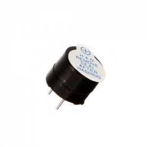
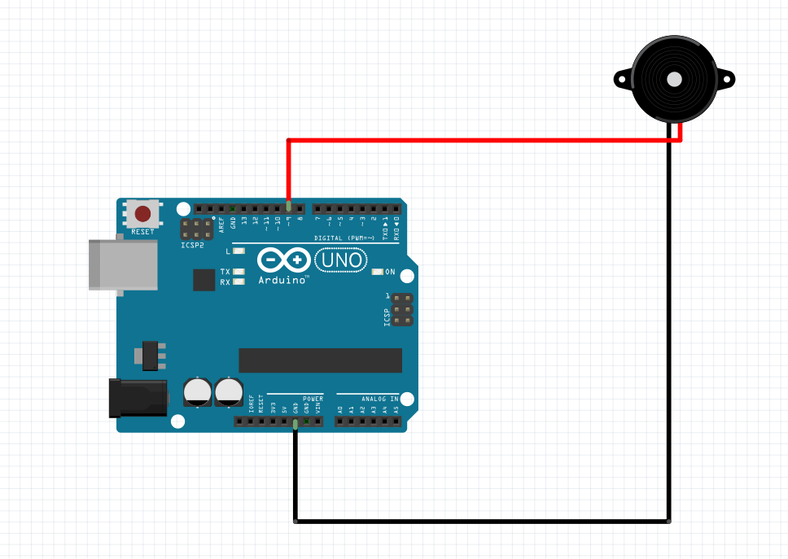

# 학교 종이 땡땡땡~~~(Buzzer)
선생님이 우리를 기다리신다. 앞서 배운 것이 소리를 감지 한 것이라면 이번에는 소리를 내는 Buzzer센서를 
써볼 것이다.  
  
부저 센서는 영어로 Piezo-Buzzer라고 부르는데 Piezo의 뜻은 그리스 어로 "누르다"라는 의미를 가지는 단어에서 유래
되었다고 한다. 용어에서 알 수 있듯이, 압전이라는 말은, 무언가를
누르거나 쥐어짜냄으로 인해 전기를 발생시킨 다는 것이다. 하지만 압전 부저는 
다른 의미이다. 압력으로 눌러서 전기를 발생 하는 것이 아니라 전기를 통해 압력이 전달 되면
그것에 통해 소리가 난다. 예를 들어 현악기 들을 생각해보면 팽팽한 장력을 가진 줄을 튕기면 줄의 진동에
의해 소리가 발생하는 원리이다. 이처럼 전기 신호가 부저에 전달되면, 전기 에너지에 의해 안의 막이 튀어 오르고
전기 신호를 다시 끊었따가 부저로 전달하면 이전과 동일하게 막이 튀어오른다. 다들 글을 보다가 짐작 하듯이
튀어 오르는 부분에서 소리가 난다.  
　  
하지만 실제 부저에 3.3V와 GND를 연결하면 타다닥 소리만 난다. 그렇다면 어떻게 음을 내고 다른 소리를 내는 것일까?  
+단자에 우리는 Arduino핀을 꼽게 된다. 아두이노의 디지털 신호에 꼽으면 알다시피 0과 1밖에 나오지 않는다. 하지만 우리는 delay함수와 arduino내의 마이크로프로세서를 통해  
여러 주기의 신호를 뽑아 낼 수 있고 주파수를 바꿀 수 있다.   
　  
즉 진동수가 높은 즉 주기가 짧아 주파수가 높은 신호를 보내면 더 높은 소리를 낸 다는 것이다. 반대로 주기가 길고 주파수가 짧아져 진동수가 낮아지면 
낮은 음의 소리가 나게 된다. 기타줄의 튜닝과 비슷하다. 줄의 장력에 따라 소리가 바뀌는 것처럼 Arduino 내의 기능을 통해 여러 음을 낼 수 있다.  
　  
그렇다면 우리는 잘만 이용하면 buzzer를 통해 내가 원하는 음을 만들어 낼 수 있는 것이다. 여러분이 수치를
하나하나 여어 음을 찾아내는 절대음감은 아닐꺼가 생각한다.  
  
위의 표를 보고 원하는 노래를 아두이노로 소리내게 할 수 있고 피아노도 만들 수 있다.  
　   
  
부저센서의 회로 설계는 정말 간단하다. -부분을 GND에 +부분을 그냥 arduino Signal핀에 여어 주기만 하면 된다. 

 
　  
       실험내용  
       
***
1. 부저 센서를 통해 도레미파솔라시도 소리 내기  
2. 부저 센서를 통해 학교 종이 땡땡땡 노래 만들기  
3. 자신만의 노래 만들어 보기  
　  
준비물  

***  
부저 센서, 아두이노, 점퍼선  
  
　  
소스코드  

***  
1. 부저 센서를 통해 도레미파솔라시도 소리 내기  (tone 함수의 이해)  
  
부저 센서를 잘 사용하기 위해서는 tone(함수를 잘 사용 할 줄 알아야 한다.) tone(pin, level, time)이런식으로 들어가는데 pin에는 pin번호를
level에는 내고 싶은 음을 time에는 음정 지속시간을 생각해 적으면 된다. 밑의 예시를 통해 tone함수를 사용해보자.

  
    int buzzer = 9;
    
    
    void setup() {
    pinMode(buzzer, OUTPUT);
    }

    void loop() {
     tone(buzzer, 262, 500);
    delay(500);
     tone(buzzer, 294, 500);
    delay(500);
     tone(buzzer, 330, 500);
    delay(500);
     tone(buzzer, 349, 500);
    delay(500);
     tone(buzzer, 392, 500);
    delay(500);
     tone(buzzer, 440, 500);
     delay(500);
        tone(buzzer, 494, 500);
       delay(500);
        tone(buzzer, 523, 500);
       delay(500);
    } 
　  
2.부저 센서를 통해 학교 종이 땡땡땡 노래 만들기 

    int buzzer = 9;
    int pause = 325;
    void setup(){
      pinMode(buzzer, OUTPUT);
    }
    
    void loop(){
      tone(buzzer, 392 ,250);
      delay(pause);
      tone(buzzer, 392 ,250);
      delay(pause);
      tone(buzzer, 440 ,250);
      delay(pause);
      tone(buzzer, 440 ,250);
      delay(pause);
      tone(buzzer, 392 ,250);
      delay(pause);
      tone(buzzer, 392 ,250);
      delay(pause);
      tone(buzzer, 330 ,550);
      delay(pause);
      tone(buzzer, 392 ,250);
      delay(pause);
      tone(buzzer, 392 ,250);
      delay(pause);
      tone(buzzer, 330 ,250);
      delay(pause);
      tone(buzzer, 330 ,250);
      delay(pause);
      tone(buzzer, 293 ,750);
      delay(pause);
      noTone(buzzer)
      delay(pause);
      tone(buzzer, 392 ,250);
      delay(pause);
      tone(buzzer, 392 ,250);
      delay(pause);
      tone(buzzer, 440 ,250);
      delay(pause);
      tone(buzzer, 440 ,250);
      delay(pause);
      tone(buzzer, 392 ,250);
      delay(pause);
      tone(buzzer, 392 ,250);
      delay(pause);
      tone(buzzer, 329 ,500);
      delay(pause);
      tone(buzzer, 392 ,250);
      delay(pause);
      tone(buzzer, 329 ,250);
      delay(pause);
      tone(buzzer, 293 ,250);
      delay(pause);
      tone(buzzer, 329 ,250);
      delay(pause);
      tone(buzzer, 261 ,750);
      delay(pause);
      noTone(buzzer)
      delay(puase);
      
    }
    void loop({
    }
    }

  
  
3.자신만의 노래 만들기 (캐리비안 해적)
　  

    const int buzzer = 9; //핀을 다른 PWM pin으로도 사용 할 수 있지만 
                        //3 또는 11번은 tone 함수를 받을 수 없다. 
                       
    const int songspeed = 1.5; //값을 2로 바꾸면 조금더 느린 버전으로 노래를 할 수 있다.
    //*****************************************
    #define NOTE_C4  262    
    #define NOTE_D4  294    //이렇게 Define하는 이유는 int나 float long double등으로 변수를 생성 할시
    #define NOTE_E4  330    //메모리에 데이터가 저장되므로 데이터가 쓰인다. 하지만 Define은 뒤에 ';'가 붙지 않는다.
    #define NOTE_F4  349    //상수는 메모리를 차지하지 않는다.
    #define NOTE_G4  392
    #define NOTE_A4  440
    #define NOTE_B4  494
    #define NOTE_C5  523
    #define NOTE_D5  587
    #define NOTE_E5  659
    #define NOTE_F5  698
    #define NOTE_G5  784
    #define NOTE_A5  880
    #define NOTE_B5  988
    //*****************************************
    int notes[] = {       0은 reset하기 위한 것이다.
       NOTE_E4, NOTE_G4, NOTE_A4, NOTE_A4, 0, 
       NOTE_A4, NOTE_B4, NOTE_C5, NOTE_C5, 0, 
       NOTE_C5, NOTE_D5, NOTE_B4, NOTE_B4, 0,
       NOTE_A4, NOTE_G4, NOTE_A4, 0,
       
       NOTE_E4, NOTE_G4, NOTE_A4, NOTE_A4, 0, 
       NOTE_A4, NOTE_B4, NOTE_C5, NOTE_C5, 0, 
       NOTE_C5, NOTE_D5, NOTE_B4, NOTE_B4, 0,
       NOTE_A4, NOTE_G4, NOTE_A4, 0,
       
       NOTE_E4, NOTE_G4, NOTE_A4, NOTE_A4, 0, 
       NOTE_A4, NOTE_C5, NOTE_D5, NOTE_D5, 0, 
       NOTE_D5, NOTE_E5, NOTE_F5, NOTE_F5, 0,
       NOTE_E5, NOTE_D5, NOTE_E5, NOTE_A4, 0,
       
       NOTE_A4, NOTE_B4, NOTE_C5, NOTE_C5, 0, 
       NOTE_D5, NOTE_E5, NOTE_A4, 0, 
       NOTE_A4, NOTE_C5, NOTE_B4, NOTE_B4, 0,
       NOTE_C5, NOTE_A4, NOTE_B4, 0,
    
       NOTE_A4, NOTE_A4, 
       //Repeat of first part
       NOTE_A4, NOTE_B4, NOTE_C5, NOTE_C5, 0, 
       NOTE_C5, NOTE_D5, NOTE_B4, NOTE_B4, 0,
       NOTE_A4, NOTE_G4, NOTE_A4, 0,
    
       NOTE_E4, NOTE_G4, NOTE_A4, NOTE_A4, 0, 
       NOTE_A4, NOTE_B4, NOTE_C5, NOTE_C5, 0, 
       NOTE_C5, NOTE_D5, NOTE_B4, NOTE_B4, 0,
       NOTE_A4, NOTE_G4, NOTE_A4, 0,
       
       NOTE_E4, NOTE_G4, NOTE_A4, NOTE_A4, 0, 
       NOTE_A4, NOTE_C5, NOTE_D5, NOTE_D5, 0, 
       NOTE_D5, NOTE_E5, NOTE_F5, NOTE_F5, 0,
       NOTE_E5, NOTE_D5, NOTE_E5, NOTE_A4, 0,
       
       NOTE_A4, NOTE_B4, NOTE_C5, NOTE_C5, 0, 
       NOTE_D5, NOTE_E5, NOTE_A4, 0, 
       NOTE_A4, NOTE_C5, NOTE_B4, NOTE_B4, 0,
       NOTE_C5, NOTE_A4, NOTE_B4, 0,
       //End of Repeat
    
       NOTE_E5, 0, 0, NOTE_F5, 0, 0,
       NOTE_E5, NOTE_E5, 0, NOTE_G5, 0, NOTE_E5, NOTE_D5, 0, 0,
       NOTE_D5, 0, 0, NOTE_C5, 0, 0,
       NOTE_B4, NOTE_C5, 0, NOTE_B4, 0, NOTE_A4,
    
       NOTE_E5, 0, 0, NOTE_F5, 0, 0,
       NOTE_E5, NOTE_E5, 0, NOTE_G5, 0, NOTE_E5, NOTE_D5, 0, 0,
       NOTE_D5, 0, 0, NOTE_C5, 0, 0,
       NOTE_B4, NOTE_C5, 0, NOTE_B4, 0, NOTE_A4
    };
    //*****************************************
    int duration[] = {        
      125, 125, 250, 125, 125, 
      125, 125, 250, 125, 125,
      125, 125, 250, 125, 125,
      125, 125, 375, 125, 
      
      125, 125, 250, 125, 125, 
      125, 125, 250, 125, 125,
      125, 125, 250, 125, 125,
      125, 125, 375, 125, 
      
      125, 125, 250, 125, 125, 
      125, 125, 250, 125, 125,
      125, 125, 250, 125, 125,
      125, 125, 125, 250, 125,
    
      125, 125, 250, 125, 125, 
      250, 125, 250, 125, 
      125, 125, 250, 125, 125,
      125, 125, 375, 375,
    
      250, 125,
      125, 125, 250, 125, 125,
      125, 125, 250, 125, 125,
      125, 125, 375, 125, 
      
      125, 125, 250, 125, 125, 
      125, 125, 250, 125, 125,
      125, 125, 250, 125, 125,
      125, 125, 375, 125, 
      
      125, 125, 250, 125, 125, 
      125, 125, 250, 125, 125,
      125, 125, 250, 125, 125,
      125, 125, 125, 250, 125,
    
      125, 125, 250, 125, 125, 
      250, 125, 250, 125, 
      125, 125, 250, 125, 125,
      125, 125, 375, 375,

      
      250, 125, 375, 250, 125, 375,
      125, 125, 125, 125, 125, 125, 125, 125, 375,
      250, 125, 375, 250, 125, 375,
      125, 125, 125, 125, 125, 500,
    
      250, 125, 375, 250, 125, 375,
      125, 125, 125, 125, 125, 125, 125, 125, 375,
      250, 125, 375, 250, 125, 375,
      125, 125, 125, 125, 125, 500
    };
    
    void setup() {
      for (int i=0;i<203;i++){              //총 노드 수는 203개다.
      int wait = duration[i] * songspeed;
      tone(buzzer,notes[i],wait);          
      delay(wait);}                        //
    }
    
    void loop() {
    
    }
