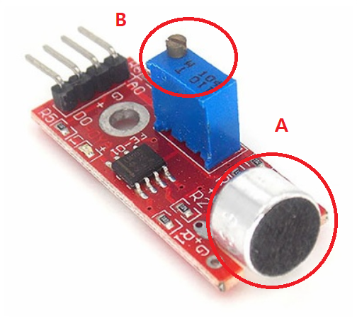
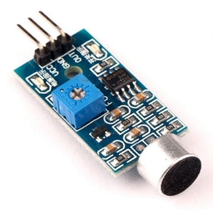
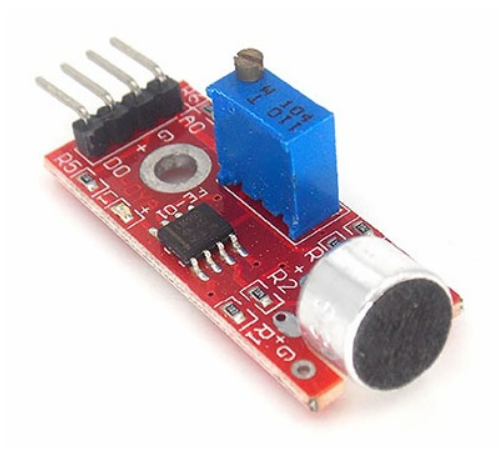
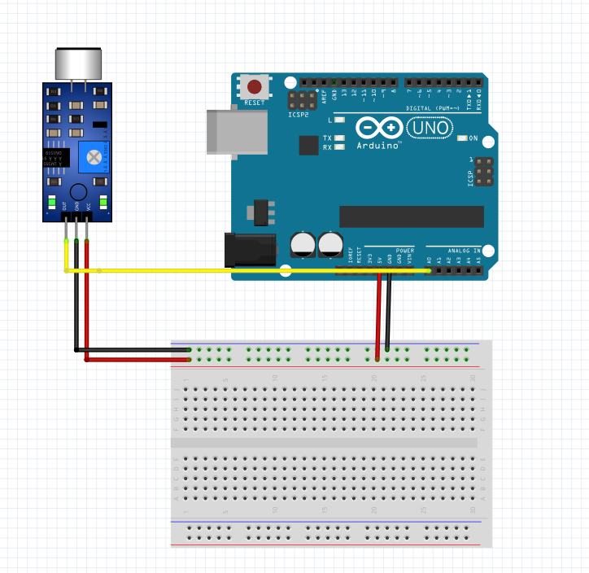
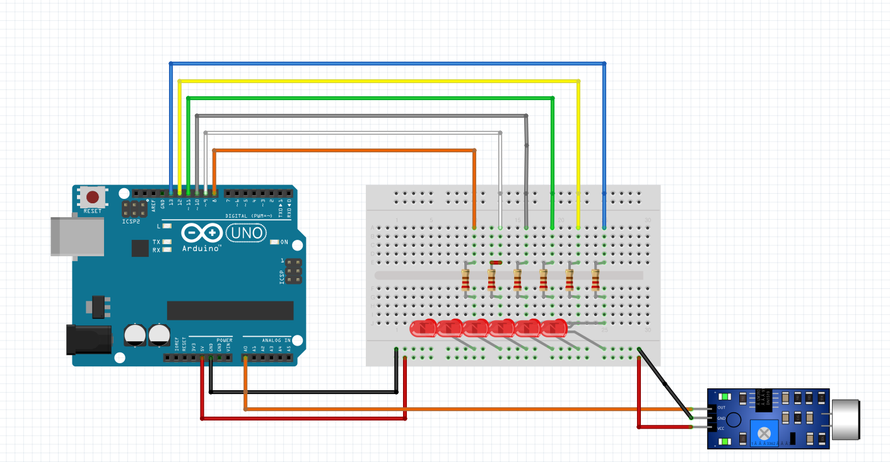

# 디지털 사운드 센서 (누가 기침 소리를 내었는가?)
    
기침 하는 사람들을 쫓아 마구니가 낀 분들로 부터 도망치기 위한 디지털
 센서 사용법입니다.(죄송합니다 교육자료 적다가 힘들어서 그만...)  
　  
　
  

사운드 센서(Sound Sensor)는 센서 주변에서 발생되는 소리를 그림의 (a)부분 마이크로 모아, 소리의 크기를 증폭 시켜 출력합니다.
만약 원하는 대상의 소리가 잘 안들리시면 그림의 (b)부분이 가변저항으로서 가변저항을 통해 감도를 통해 조절 할 수 있습니다.  
  
우리는 이러한 사운드 센서를 통해 기타 튜너, 마이크, 인공지능 스피커 등 소리를 감지하는 것이 필요한 것에 사용
할 수 있다. 이러한 사운드 센서는 두가 지 종류로 나눠 진다.  
　  
  
위와 같은 경우는 Out단자가 하나인 모듈이고 출력 단자가 하나 밖에 없어 소리가 일정 수준 이상이 되었을 때 한가지 동작을 할 수 있다.  
　  
  
위 그림은 출력 단자가 D0와 A0즉 디지털 출력단자와 아날로그 출력단자 두개로
나누어져 있는 경우로 소리의 세기에 따라 각각 다른 동작을 할 수가 있다.  
　  
이러한 센서들이 작동하는 원리는 공기의 진동을 통해서 전달되는 파동을 통해서 신호를 만들어 내는 것이다.
즉 우리의 귀가 듣는 것과 아주 비슷하다. 이러한 진동을 전기신호로 바뀌어 아두이노에 전달하게 되면 소리가 신호로 바뀌게 된다.  
　  
실험내용
***  
1. 아날로그 센서를 통한 dB측정    
2. 디지털 사운드 센서를 통한 박수 횟수에 따라 LED켜지기  
　  
준비물
***
아누이노 우노, 브레드 보드, 점퍼선, LED, 저항, 디지털 사운드 센서  
1. 아날로그 센서를 통한 dB측정(시리얼 플로터 사용하기)    
  
　  
2. 디지털 사운드 센서를 통한 박수 횟수에 따라 LED켜지기
   
　  
소스코드  
***
1. 아날로그 센서를 통한 dB측정(시리얼 플로터 사용하기)  

　
    
    int SoundSensor = A0;     // 사운드 센서 설정
    void setup() {               
      Serial.begin(9600); // 시리얼모니터 사용
      pinMode(SoundSensor,INPUT)
    }
    
    void loop() {     
      int level = analogRead(SoundSensor);
      Serial.println(level);
      delay(300);
    }
　　  
2.디지털 사운드 센서를 통한 박수 횟수에 따라 LED켜지기  

  

    int soundSensor = A0;     // 사운드 센서 핀
    int led[6] = {8, 9, 10, 11, 12, 13};  // LED핀 8~13
    int limit = 300;
    int count = 0;      // 박수를 몇 번 쳤는지 카운트
    
    void setup() {               
      Serial.begin(9600); // 시리얼모니터 출력
      pinMode(soundSensor, INPUT);  // 사운드 센서 입력으로 설정  
      for(int i=0; i<6; i++)      // LED 핀 출력으로 설정
        pinMode(led[i], OUTPUT);    
    }
    
    void loop() {     
      if( analogRead(soundSensor) >= threshold){    // 감지된 소리의 크기가 300 이상일 때
        for(int i=0; i<6; i++){ // 6개의 led 제어
          if(i == count)        // 카운트 된 박수 개수로 led 제어 
            digitalWrite(led[i], HIGH);   
          else 
            digitalWrite(led[i], LOW);
        }
        count = (count < 6) ? count+1 : 0;  // count<6가 참일 때 count + 1, 거짓일때 0 반환
        delay(200);     // 박수 중복 입력이 안되게 200ms 딜레이
      } 
      else       // 감지된 소리의 크기가 300 이하일 때 
        delay(1);
    }