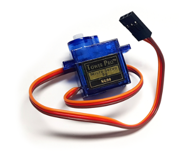
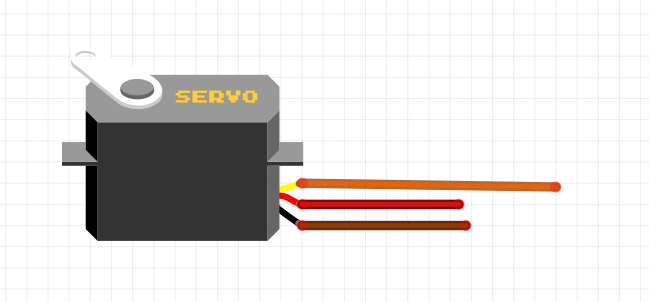
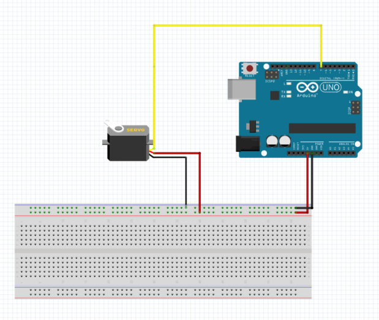

# 이잉 츠크 이잉 츠크 모모 터터
모터라고 하면 사람들이 흔히 생각하는 것이 자동차에 바퀴에 달린 것을 모터라고 생각한다.
하지만 이번 프로젝트에서 사용하고 싶은 모터는 무식하게 이잉 빠르게 움직이는 모터가 아니라 천천히 우리가 원하는 각도로 움직이는
관절을 만들기 위한 모터가 필요하다. 이러한 기능을 하기 위해 가장 적합한 서보 모터를 우리는 사용 할 것이다. 
　  
## 서보 모터  
  
서보 모터는 일반 모터와 다르게 회전할 수 있는 각도가 정해 져 있다. 서보 모터라고 불리는 이유는 
Servo(따르다 : 사용자의 명령을 따르는 착한 친구)라는 뜻을 가지고 있다. 이의 의미를 통해 보게 되면
우리가 원하는 데로 가지고 놀 수 있다는 것이다. 즉, 우리가 원하는 각도로 속도로 제어 할 수 있는 것이다.
이것은 로봇, 장난감, 드론, CCTV 등 여러 곳에서 쓰인다. 위의 사진은 [SG90](http://mechasolution.com/shop/goods/goods_view.php?goodsno=586229&category=) 으로 굉장히 저렴하다.
대신 각도가 0~180도 까지 움직이지 못한다는 단점이 있다.  ㅇ
　  

  
　  
우리는 서보모터의 datasheet를 뜯어 볼 필요가 있다. 어떤 원리로 작동하는지 어떤 성능을 가지는지 꼭 알아야한다. 폴더에 sg90의 datasheet
를 여어 놨으니 꼭 한 번 보길 바란다.  
데이터 시트를 보면 PWM을 사용하여 서보모터를 제어 할 수 있다. 서보모터의 펄스폭은 1ms~2ms의 범위를 가지며 1ms 일때 0도, 2ms일때 180도를 나타낸다. 
그렇다면 45도를 나타내려면 1ms/4 = 0.25ms이므로 1.25ms로 나타 낼 수 있고 1.5ms 일 때는 90도라는 것을 유추할 수 있다.  
　  
하지만 이렇게 하나하나 계산해서 시간을 여어 servo모터를 계산하기에는... 매번 서보 모터마다 datasheet를 뜯어서 Duty Cycle, Power and Signal, PWM Period, 주기 등등 계속 찾아야 한다. 이렇게 귀찮은 계산을 계속 하는 것을 안하기 위해서 우리는 라이브러리를 사용한다.(라이브러리 추가 방법) 
  
위 사진에서 주황색 : 데이터핀, 빨간색 : VCC, 갈색 : GND이고 다른 경우도 있으니 참고 바란다.  
　  
실험 내용
***
1. 모터가 0도 에서 180도 까지 계속 왔다 갔다 하게 하여 어디 까지 움직이는지 확인한다.  
2. 시리얼 모니터에 입력을 통해 서보모터를 자신이 원하는 각도로 회전해 보자.  
　  
***
준비물  
아두이노 보드, 브레드 보드, 점퍼선, 서보모터  
    
　  
소스 코드  

***  
1. 모터가 0도 에서 180도 까지 왔다 갔다 움직이게 한다.   
　  

  
  
  　  
  

    /* 서보모터를 0도 부터 180도 까지 움직이게 한다.*/
    #include <Servo.h>                     //servo 함수 호출
    Servo servo;                           //Servo 객체 생성
                                           
    
    void setup(){                          //처음 시작히전에 Servo의 핀과 Serial 창을 띠우기 위해 셋팅을 한다.
      servo.attach(7);                     //서보 모터의 signal 핀을 자신이 꼽은 곳에 설정한다.
      Serial.begin(9600);                  //Serial 창을 띠우고 통신 속도를 입력한다 Serial.begin(speed)
    }
    void loop(){                           //무한으로 반복할 알고리즘을 적기 위한 공간이다.
        for(int i =0; i <=180;i++){           //i를 0부터 180 까지 1씩 더하는 반복문이다
            servo.write(i);                      // servo.write(degree)로 서보 모터의 각도를 조절한다.
            delay(10);                           // 지연시간을 10ms로 지정한다.
        }
        for(int i =180; i >= 0;i--){         //i를 180부터 0까지 1씩 빼는 반복문이다.
        servo.write(i);                      // servo.write(degree)로 서보 모터의 각도를 조절한다.
        delay(10);                           // 지연시간을 10ms로 지정한다.
        }
    }
     
　  
 
  
　  
2.시리얼 모니터에서 입력값을 통해 서보모터를 자신이 원하는 각도로 회전해 보자.  
      
    /* 서보모터를 0도 부터 180도 까지 움직이게 한다.*/
    #include <Servo.h>                     //servo 함수 호출
    Servo servo;                           //Servo 객체 생성

    int motor = 7;                                   
    int angle = 0;
    void setup(){                          //처음 시작히전에 Servo의 핀과 Serial 창을 띠우기 위해 셋팅을 한다.
        servo.attach(motor);                     //서보 모터의 signal 핀을 자신이 꼽은 곳에 설정한다.
        Serial.begin(9600);                  //Serial 창을 띠우고 통신 속도를 입력한다 Serial.begin(speed)
  
        Serial.println("Enter the u or d");
        Serial.println("u = angle + 15");
        Serial.println("d = angle -15\n");
        Serial.println("Variable       Current degree");
        servo.write(0);     
    }
    void loop(){                           //무한으로 반복할 알고리즘을 적기 위한 공간이다.
        if(Serial.available())  // 시리얼모니터가 사용가능할 때
            {
            char input = Serial.read(); // 문자 입력받기
     
            if(input == 'u')    // u 키를 누를 때
                {
                Serial.print("+15");  // '+15'를 시리얼 모니터에 출력
                if(angle>=180){
                angle = 180;
                Serial.print("각도를 더 늘릴수 없습니다!");}
            else{
                angle +=15;         
                servo.write(angle); 
                delay(10);
                Serial.print("\t\t");
                Serial.println(angle);}  // 현재 각도 출력
                } 
        else if(input == 'd')   // 'd'키를 입력했을 때
            {
            Serial.print("-15");  // '-15'를 시리얼 모니터에 출력
            if(angle<=0){
            angle = 0;
            Serial.print("각도를 더 줄일수 없습니다!");}
        else{
            angle -=15;        
            servo.write(angle); 
            delay(10);
            Serial.print("\t\t");
            Serial.println(angle);}  // 현재 각도 출력
            }
        else if(input == '\n')
            {
            Serial.println("");
            }
        else
            {
            Serial.println("잘못된 입력입니다!!");
            }
        }
    }
  

