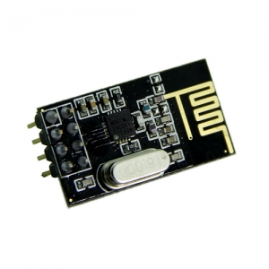
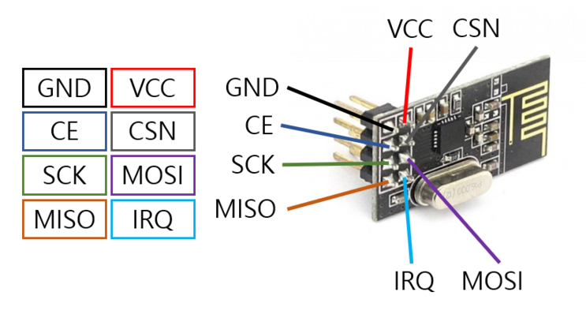
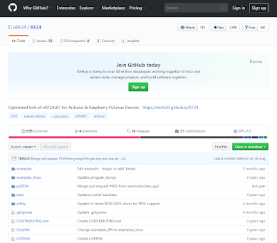
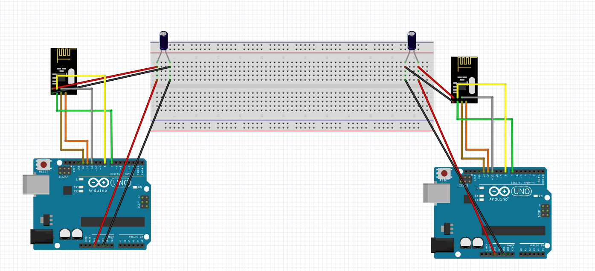

# 시그널보내~ 시그널보내~ 찌릿찌릿찌릿(RF모듈)

   
    
    
 이전에 썼던 블루투스 모듈은 1대 1통신이자 근거리 통신이라는 단점이 있다. 하지만 우리는 신호를 멀리 그리고 Multi 통신을 하고 싶다.
 그렇다면 우리가 어떤 통신을 써야할까? 하지만 쓰기 위해서는 먼저 어떤 통신을 사용할지 결정해야 한다. 저번처럼 가깝고 근접한 IoT와 연결 하기 위해서는
 블루투스를 사용하지만 무선 통신에는 정말 많은 것들이 있고 여러 프로토콜이 존재한다. 적외선 통신, NFC, Wifi, RF 통신, LoRa,
 Zigbee, 3G/LTE 등이 존재하고 최근에 5G 통신망이 나왔다. 우리가 흔히 볼 수있는 찌릿찌릿한 통신을 쓰는 것은 트와이스 시그널 아...아니 Radio를 예로 들 수 있다.
 위의 통신들은 전부 특성이 있고 서로 상황에 맞는 무선 통신 서비스를 사용한다. 이번에는 RF(Radio Frequency)모듈을 사용할 예정이다.  
 　  
   
우리가 사용하려고하는 RF모듈은 nRF24L01P 모듈로 2.4G 주파수 영역을 사용한다. 또한 1 그리고 2Mbps의 데이터 전송 속도를 가지고
GFSK modulation 방식이다. 뭐 이렇게 어려운 말들은 그만 하겠다.  
   
 어려운말 그만한다고 했지만 또 어려운 부분들이 많다. 여기서 CE, CSN부분은 마음대로 핀번호를 설정하여 사용하면 된다. 하지만 
 SPI 커뮤니케이션을 위해서 사용하는 핀은 11(MOSI), 12(MISO), 13(SCK) 3개는 항상 동일하게 꼽아야한다. 이 이류를 묻는다면
 처음에 [Arduino_basic](https://github.com/alscjf909/Arduino_basic) 에서 설명하였다. 이것을 보고도 모른다고 하면  
    
 펀쿨섹좌 : 음..그건 약속이니깐....어쩔수 없습니다. 약속입니다...  
 　  
 하여튼 핀은 밑에 나올 회로도를 보고 따라 꼽으면 되고 대신 CE, CSN부분은 원하는 것을 설정해주고 꼽으면 될 것이다. 그리고 IRQ는
 연결 하지 않는다. 저것도 약속입니다... 사실 잘 모르겠습니다. 이 모듈의 원리를 설명하려면 디지털통신부터 통신이론까지 다설명해야되므로
 생략하겠습니다.   
 　  
 이제 실험으로 넘어가려고하는데 먼저 우리는 RF24라이브러리가 필요하다. 아래 이미지를 클릭하면 사이트로 들어가 라이브러리를 다운 받을 수 있다.  
                        [](https://github.com/nRF24/RF24)  
 　  
 이제 라이브러리 다 다운받았으면 프로젝트를 시작하면된다.  
 ※ 먼거리 프로젝트를 하면 노이즈가 생길 수 있는데 VCC부분과 GND부분에 1~10uF를 연결해 사용하면 Noise Filter역할을 하여
 잡음이 줄어들 것이다.   
 nRF24L01 모듈 두개를 연결하려면 주소값을 같게 설정하면된다.  
 
    const byte address[6] = "00001"; //주소값을 5가지 문자열로 변경할 수 있으며, 송신기와 수신기가 동일한 주소로 해야됨.
   
 ### 실험내용
 ***  
 1. Hello world 전송  
 　  
 ### 준비물
 ***  
 아두이노 우노, 브레드 보드, 점퍼선, 커패시터  
 
   
 　  
 ### 소스 코드  
 ***
 실험1. 송신단
 ```arudino
#include <SPI.h>
#include <nRF24L01.h>
#include <RF24.h>
RF24 radio(7, 8); // SPI 통신를 사용 설정을 위한 CE, CSN를 선언.
const byte address[6] = "00001"; //주소값 5가지 문자열로 가능, 송신기와 수신기가 동일한 주소로 해야 통신 됨
void setup() {
  radio.begin();
  radio.openWritingPipe(address); //위에 설정한 5글자 문자열인 데이터를 수신의 주소로 설정
  radio.setPALevel(RF24_PA_MIN); //전원공급에 관한 파워레벨을 설정합니다. 가까울수록 작게

//거리가 가까운 순으로 RF24_PA_MIN / RF24_PA_LOW / RF24_PA_HIGH / RF24_PA_MAX 등으로 설정할 수 있습니다.

  radio.stopListening();  //모듈을 송신기로 설정
}
void loop() {
  const char text[] = "Hello World";
  radio.write(&text, sizeof(text)); //해당 메시지를 수신자에게 보냄
  delay(1000);
}
```
　 
 실험1.수신단
 ```
 #include <SPI.h> 

#include <nRF24L01.h>
#include <RF24.h>
int LED =4;
RF24 radio(7, 8); // SPI 버스에 nRF24L01 라디오를 설정하기 위해 CE, CSN 선언.
const byte address[6] = "00001"; //주소값을 5가지 문자열로 변경할 수 있으며, 송신기과 수신기가 동일한 주소로 해야됨.
void setup() {
  pinMode(4, OUTPUT);
  Serial.begin(9600);
  radio.begin();
  radio.openReadingPipe(0, address);
  radio.setPALevel(RF24_PA_MIN); //전원공급에 관한 파워레벨을 설정합니다. 모듈 사이가 가까우면 최소로 설정합니다.

//거리가 가까운 순으로 RF24_PA_MIN / RF24_PA_LOW / RF24_PA_HIGH / RF24_PA_MAX 등으로 설정할 수 있습니다.
  radio.startListening(); //모듈을 수신기로 설정
}
void loop() {
  if (radio.available()) {
    char text[32] = "";
    radio.read(&text, sizeof(text));
      Serial.println(text);
      delay(500);


}
}
```

